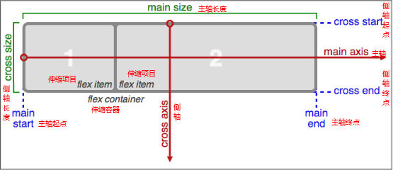

#  js复习
## 一、js数据类型/流程控制

###  数据类型
		1.简单数据类型（栈）
			(1)string;(2)number;特殊值:NaN (3)boolean;(4)undefined;
			1.1 typeof
			typeof 用于检测简单数据的类型;
			1.2 数据类型之间的转换
				1.2.1 其他数据类型转number
					a.Number()
						可用于任何数据类型转number
						**注意点**
						1.（）里面的内容可看成数字就可以转我Number;如果不是数值，则会转为NaN;
						2.（）里面是数值，但是数值之间有空格，也会转为NaN;
						3.（）为空或者是空格，会转换为0；
					b.parseInt()
						专用于字符串的转换;
						**注意点**
						1.（）里面的内容从左往右查找开始转换，如果遇到数字转为数字就会转为Number类型，一旦遇到非数字,则停止转换
						2.（）里面如果为空，则会转为NaN;
						3.（）里面的字符串如果是小数，那么只会转换整数部分；
					c.parseFloat()
						与parseInt()用法相类似，唯一区别是parseFloat()可以转换小数部分
				
				1.2.2 其他数据类型转string
					a.string()
						string(obj)// 可以转null 和 undefined;
					b.toString()
						obj.toString() // 不能转 null 和 undefined;

				1.2.3 其他数据类型转boolean
					a. 对需要转换的内容进行算数运算
					b. 在需要转换的内容前面加 ‘+’
					c. Boolean()
						null,空字符串,false,0,NaN,undefined   可以转为false;
						*空格会转为ture;

		2.复杂数据类型（堆）
			（1）Array (2) object (3) Data对象 (4) function(){} (5)null
###   Math对象
		1.2.1 Math.pow(a,b)  a的b次方
		1.2.2 Math.round()  四舍五入
		1.2.3 Math.ceil()   向上取整
		1.2.4 Math.floor()   向下取整
		1.2.5 Math.max()   最大值
		1.2.6 Math.min()   最小值
		1.2.7 Math.random()   随机生成一个0~1之间的数字


###   运算符的比较
		1.如果两个值具有相同的类型，那么就检测他的等同性.
		2.如果两个值的类型不同，则用以下规则
			2.1 如果一个值类型是null,另一个值类型是undefined;  则他们相等
			2.2 如果一个值是数字，另一个是字符串，则将字符串转化为数值再进行比较
			2.3 如果一个是true,将它转为1；在进行比较,false也一样；
			2.4 如果一个值是对象，另一个值数字或字符串，将对象转换成原始类型的值，在进行比较
			2.5 其他的数值组合是不相等的；
###  选择结构
-  if(){ 		 }
-  if(){ 		 }else{  }
-  if(){   }else if(){		}else{			}
-  switch( ){ case: ; break}
-  三元表达式   A>B ? tur : false;

###  循环结构
-  for(var i = ?; i < ? ; i++){	}
-  while( ){ 循环体 }
-  do{ 循环体 }while( )

		循环中的break和continue;
			1.循环中，如果遇到break,就会结束当前的循环；
			2.循环中，如果遇到continue,就会结束当前次的循环，但仍进行下一次循环；

##  Array()方法&&String对象方法

###    数组的方法

		2.1.1 数组的长度
			arr.length;
			清空数组的方法：（1）arr.length = 0; (2) arr = [];

		2.1.2 concat() 
			方法用于链接合并多个数组，
			var a = [1,2,3]; a.concat(4,5); ==> 1,2,3,4,5

		2.1.3 join() 
			用于把数组中的所有元素放入一个字符串。
			arr[0] = "George"
			arr[1] = "John"
			arr[2] = "Thomas"
			arr.join() ==> George,John,Thomas;
			join()中可以放入分隔符，输出结果就是以括号内分隔符分隔的字符串

		2.1.4 pop() 
			用于删除并返回数组的最后一个元素。
			var arr = new Array(3)
				arr[0] = "George"
				arr[1] = "John"
				arr[2] = "Thomas"

				arr.pop() ==> "Thomas"
			arr ==> ["George","John"]

		2.1.5 push()
			向数组的末尾添加一个或多个元素，并返回新的长度。
			var arr = new Array(3)
				arr[0] = "George"
				arr[1] = "John"
				arr[2] = "Thomas"

			arr.push('sandy');
			arr ==> ["George","John","Thomas","sandy"]
		
		2.1.5 shift() 
			用于把数组的第一个元素从其中删除，并返回第一个元素的值。
			var arr = new Array(3)
				arr[0] = "George"
				arr[1] = "John"
				arr[2] = "Thomas"

			arr.shift() ==> "George"
			arr ==> [John,Thomas];

		2.1.6 unshift() 
			可向数组的开头添加一个或更多元素，并返回新的长度。
			var arr = new Array()
				arr[0] = "George"
				arr[1] = "John"
				arr[2] = "Thomas"

			arr.unshift("sandy");
			arr ==> ["sandy","George","John","Thomas"]

		2.1.7 reverse()
			颠倒数组中元素的顺序。

		2.1.8 slice()
			可从已有的数组中返回选定的元素；可用于提取数组的某一部分；
			var arr = new Array(3)
				arr[0] = "George"
				arr[1] = "John"
				arr[2] = "Thomas"
				arr[3] = "James"
				arr[4] = "Adrew"
				arr[5] = "Martin"

			arr.slice(2,4) ==>Thomas,James  end索引上的数组不会被截取
			arr ==>George,John,Thomas,James,Adrew,Martin //也就是，slice不会改变数组的长度，并不会修改数组！
			
		2.1.9 splice()
			方法用于插入、删除或替换数组的元素
			arr.splice(从何处删除/添加元素,删除或添加的数量,向数组中添加的元素(可以是多个元素))

			splice() 方法会直接对数组进行修改！

####	ES5新增的数组方法

- forEach()

	arr.forEach(function(item,index,arr){});//forEach没有返回值，返回的只有undefined;

- map()

	arr.map(function(item,index,arr){});//可以设置返回值，return的值组成新数组；

- filter()

	过滤数组，返回新过滤后的数组.

	arr.filter(function(item,index,arr){ if(){return true}else{return false}});

###    字符串String对象的方法

		2.2.1 charAt()
			返回指定索引位置上的字符；
			var str="Hello world!"
				str.charAt(1) ==> e;
		
		2.2.2 concat()
			链接字符串; 类比数组中的concat();
		
		2.2.3 indexOf() 
			返回某个指定的字符串值在字符串中(首次)出现的位置;如果找不到该字符，则会返回-1；
			var str="Hello world!"
			str.indexOf('H') ==> 0;

		2.2.4 lastIndexOf()
			类比 indexOf()  返回一个指定的字符串值最后出现的位置

		2.2.5 replace() 
			用于在字符串中用一些字符替换另一些字符，或替换一个与正则表达式匹配的子串；
			string.replace(regexp/substr规定子字符串或要替换的模式,replacement规定了替换文本)

		2.2.6 slice() 
			提取字符串的某个部分，并以新的字符串返回被提取的部分；
			str.slice(start,end);
			类比数组中的slice()方法；

			类似的还有：substring();substr;

		2.2.7 trim()
			去掉字符串首位的空格

		2.2.8 split()
			将字符串以某种分隔符分隔并以数组方式返回；
			类比数组中join();与之相反

##  function
###   函数的定义
			函数的定义：(1) function fn(){	};  (2) var fn = function(){	};   (3) 构造函数   
				function fn(){ };
				var F1 = new fn();

---  
###   函数的返回值
			函数中的return关键字，return可以结束当前函数，可以设置函数的返回值；
		如果return后没有跟内容，返回undefined;如果函数内容没有写return,返回的也是undefined;


 + **构造函数中设置返回值的情况**
 + 
		1）.如果返回值是一个基本数据类型，则会被忽略；
		2）.如果返回的是一个复杂数据类型，则会返回该数据类型，将new关键字创建的对象替换！

---
###  作用域
		js中作用域：（1）全局作用域：script标签里面，任意的函数外部。（2）局部作用域：任意的函数内（在js中，只有函数能分割作用域。）；

##   Date对象

			var date = new Date();		
			年  ---   date.getFullYear()
			月  ---   date.getMonth()+1  //默认月份从0开始计算，如要获取当前月份则需要进行+1；
			日  ---   date.getDete();
			小时 ---   date.getHours();
			分   ---   date.getMinutes();
			秒   ---   date.getSeconds();

##   Object

### 对象的创建
		(1) var obj = new Object();
			obj.name = "sandy";
			obj.age = "20";
			获取对象中的属性： 1） obj.name    2)  obj["name"]

		(2) var obj = {"name":"sandy","age":"20"}

###  forin 遍历对象中的属性
		var obj = {'name':'sandy','age':'20','skill':'lovely'}
			for(var key in obj){
				console.log(key + '---' + obj[key]);
			}
		// name---sandy;age---20;skill---lovely;

##  DOM

###  获取节点的几个方式
			1）document.getEelementById()
			2) document.getEelementByTagName() //通过标签名获取节点 获取的是一个伪数组；
			3）docuemnt.getEelementByClassName()   //通过类名获取节点 获取的也是一个伪数组；
				给一个节点设置类：ele.ClassName = '';


###  	innerHTML、innerText/textContent
		1.innerHTML
			1) 获取；可以获取标签间的内容，如果标签间只有文本的话，则是直接获取，如果标签间还有嵌套标签的话，标签名也一并获取；
			2）设置；可以给标签内嵌套内容，如果标签间还有嵌套标签，则标签会被渲染出来；

			兼容问题：没有兼容问题，所有浏览器都支持；

		2.innerText
			1) 获取；通过innerText获取内容，如果还有嵌套的标签，只获取内容！
			2) 设置；通过innerText设置内容，如果还有嵌套的标签，标签不会被渲染!会被转义成现在页面中；


			兼容问题：有兼容问题。低版本的火狐浏览器不兼容
		
		3.textContent
			与innerText 作用一样；

			兼容问题： 低版本的IE浏览器不兼容；

###   	DOM中的事件

			
				ele.onclick (单击)
				ele.ondblclick (双击事件)
				ele.onfocus (获取焦点事件)
				ele.onblur (失去焦点事件)
				ele.onkeydown (键盘按下事件)
				ele.onkeyup (键盘抬起事件)
				ele.onmouseover(鼠标移动事件)
				ele.onmousedown (鼠标按下事件)
				ele.onmouseup (鼠标抬起事件)
				ele.onmouseout (鼠标离开事件)

###   DOM动态创建元素
		1）document.write()
		2) innerHTML
			创建大批量的标签，多用于创建展示的标签
		3）document.createElement() 重点；

###  DOM中设置自定义属性
		1）设置自定义属性
			ele.setAttribute();
		2) 移除属性操作
			ele.removeAttribute();
		3) 获取属性值
			ele.getAttribute();

###  节点类型判断

	1.nodeType
		node.nodeType;//判断节点的类型；

		标签节点----1；
		属性节点----2；
		文本节点----3；
		注释节点----8；

	2.nodeName
		node.nodeName;//获取节点的类型字符串格式；
	
		标签节点----标签名;
		属性节点----属性名；
		文本节点----#text;
		注释节点----#comment#;

	3.node.Value;
		node.nodeValue;

		标签节点----null；
		属性节点----属性值；
		文本节点----文本的内容；
		注释节点----注释节点；
		

###   DOM中节点的操作

- 6.6.1 获取上一个节点

			previousSibling获取前一个节点，高级浏览器中可能或获取到空白文本节点、注释等；低版本的IE浏览器会忽略空白文本或注释；
			previousElementSibling,  高版本浏览器忽略中间的空白文本或者注释，获得标签文本；而低版本的IE不支持此方法，具有兼容性问题！
		
				function getPreviousEle(ele){
				        if(ele){
				            if(ele.previousElementSibling){
				                return ele.previousElementSibling;
				            }else{
				                ele = ele.previousSibling;
				                while(ele.nodeType != 1){
				                    ele = ele.previousSibling;
				                }
				                return ele;
				            }
				        }
				    }
				
- 6.6.2 获取下一个节点

			nextSibling 高版本浏览器会获取到空字符串    低版本的IE浏览器只能获取到标签节点；
			nextElementSibling 高版本浏览器只会获取到标签字符串    低版本的IE有兼容性；
				
				参照上一个封装兼容！

- 6.6.3 获取第一个节点

			firstChild   浏览器会获取到空白文本或者注释；
			firstElementChild   高版本浏览器会忽略空白文本节点和注释节点   低版本IE浏览器支持

- 6.6.4 获取元素的节点

			childNodes   高版本的浏览器会将所有的节点获取  包括  空白文本节点、注释节点、标签节点    低版本的浏览器IE 会将空白文本节点忽略；

			children   高板的浏览器只会获取到子元素中标签节点   忽略了 空白文本节点和注释节点    低版本的浏览器IE   还是会将注释节点获取；

- 6.6.5 获取最后一个节点

			lastChild 获取元素的最后一个节点，高版本的浏览器会获取到空白问题本，较低版本的IE浏览器会忽略空白文本节点和注释；
			lastElementChild 获取的元素最后一个节点。高版本的浏览器会忽略空白文本节点和注释。而低版本的IE浏览器不兼容

- 6.6.6  克隆节点

			ele.cloneNode(true/false)
				false -- 表示浅度克隆，只会克隆标签及属性;
				true -- 深度克隆，会克隆标签的一切内容;

- 6.6.7  追加节点

			ele.appendChild(增加的节点)；
			从父元素中追加节点到最后一子节点之后；

- 6.6.8  插入节点 

			ele.insertBrfore(要插入的节点，位置）;
			从父元素中插入节点;

- 6.6.9  移除节点

			ele.removeChild(要移除的节点)


###   定时器

- setTimeout(fn,time);
	
		间隔多少秒自后施行匿名函数里面的代码，只执行一次！
		
		清除定时器：
				var timeId = setTimeout();
				clearTimeout(timerId);

- setInterval(fn,time);
		
		间隔多少秒后执行匿名函数的代码，一直循环的执行！

		清楚定时器:
				var timeId = setInterval();
				clearInterval(timeId);

###  获取元素的属性值

- 1.currentstyle

		ele.currentStyle.width/ele.currentStyle['width'];

		IE支持（谷歌、火狐不支持）；

- 2.getComputedStyle

		window.getComputedStyle(ele,null).width

		IE8不支持；

###  offset
	
			Dom元素中，ele.style.name 获取到的属性值只能是行前的样式，不能获取到内嵌的样式；
		而offset的方式不但可以获取到行内的样式，内嵌的样式也可以获取到！

- 1.offsetwidht/offsetheight

		ele.offsetwidth/ele.offsetheight  获取到元素的宽度和高度;

		注意： offsetwidth/offsetheight = width/height + padding + border

- 2.offsetlLeft/offsetTop

		ele.offsetLeft/ele.offsetTop
	
		获取的是自己的边框到最近定位的父级元素内边框的距离，若父级元素没有定位，则距离获取到body；

		且获取的值只能获取到整数，碰上小数则会四舍五入

> offsetLeft与style.left的区别
	
		1.style.left 是以margin的左上角为准，而offsetLeft是以border左上角为准；
		2.style.left 只能获取行内样式；
		3.style.left 是可读写属性，而offsetLeft是只读属性；
		4.style.left 获取的是带有单位的字符串格式的属性值，offsetLeft获取的是number类型的属性值；

###  scroll

- 1.scrollwidth/scrollheight

		ele.scrollwidth/scrollheight = widht/height + padding + 内容超出的部分;

- 2.scrollTop/scrollLeft

		获取的是页面被卷去的部分；

		一般都会配合window.onscroll事件一起使用！


###  client

- clientWidth/clientHeight

		clientWidth/clientHeight = width/hegiht + padding
		
		获取可视区的宽度和高度，一般用于响应式，配合window.onresize事件进行使用；

###  事件对象

	每个元素注册事件之后，在执行事件的时候，都会有一个事件对象；

	ele.onclick = function(event){ event = event || window.event }

		事件对象event,里面可以获取到很多属性;
			event.pageX/pageY;当前位置坐标到页面左上角的距离
			event.clientX/clientY;当前位置坐标到当前可视区左上角的距离
			event.type ; 检测事件的类型
			event.target;  事件的源头 ---   event.srcElement(IE8)
			event.currentTarget; 正在执行事件处理程序的当前对象
			event.which; 获取鼠标按钮触发 : 1.左键； 2.中键；  3.右键

###   注册事件的另一种形式

- addEventListener/attachEvent

		好处是可以对同一个对象注册多个相同事件名称；

		1.ele.addEventListener('click',fn,false);//IE8不支持

		2.ele.attachEvent('onclick',fn);//仅IE8支持

###  移除事件

		1.removeEventListener('type',fn,false);

		2.detachEvent(on+'type',fn);

		3.ele.onclick = null;

###  事件冒泡
	
		当一个元素的事件被触发，同样的事件会在当前对象的所有的祖先元素中一次的被触发，
	这种现象叫做事件的冒泡；
		
		好处：事件委托；

		清除冒泡阻止事件冒泡：event.stoppropagation;//IE8不支持
					event.cancleBubble = true;


		在js中阻止a标签的默认跳转：
			event.preventDefault();//IE8不支持
			event.returnValue = flase;

###  事件捕获

		与事件冒泡相反，从祖先元素开始，知道目标触发；

###  事件的三个阶段

	1.捕获阶段 ---> 2.目标阶段 ---> 3.冒泡阶段

###  正则表达式

	1.正则的声明
	var reg = new RegExp();
	var ret = /定义的规则/；

	2.正则的匹配
		text()
			语法：reg.text(obj)
			匹配字符串中是否存在指定的正则表达式，返回布尔值；
		
		exec()
			语法：reg.exec(obj)
			匹配字符串，执行成功返回相关信息的数组，如果失败返回null;

	3.常用的一些正则的规则
		\d  digit   数字
		\D			非数字字符
		\s	space	不可见字符	
		\S			可见字符
		\w	word    大小写字母熟悉或_
		\W			与\w相反

	4.自定义正则规则
		|     		 表示或
		()  		 提升优先级
		[]  		 表示匹配[]中任意的字符
		[^ ]		 表示取反，出[]内字符外的字符
		[a-z] 		 -表示区间

	5.边界
		/^ .. /		表示以什么开头；
		/ .. $/ 	表示以什么结尾；

	6.量词
		*	重复0次或多次   x>=0;
		+   重复1次或多次   x>=1;
		?   重复0测或1次    x = (0||1);
		{n}  表示前面的字符出现{n}次；
		/^..$/    表示严格匹配；   

##  BOM

	BOM--浏览器对象模型；
	- window对象是javascript中的顶级对象
	- 所有定义在全局作用域中的变量、函数都会变成window对象的属性和方法
	- window对象的属性和方法在调用时可以省略window
	
---
	- window.open(url,target,param) // target（窗口打开的位置）,param(窗口的属性，宽高等)；有返回值
	- window.close()
	
###	  location

- window.location

	- location相当于浏览器的地址栏 // 可以将url解析成独立的代码片段
	- window.location.href = 'http//www.baidu.com'
	- window.reload(true/false) // true:从本地缓存重新加载 ； false:从服务器重新加载数据

###		navigator

- window.navigator

	可以获取客户端的一些信息

	- window.navigator.userAgent 获取用户电脑的版本信息
	- window.navigator.platform 

###		history

- window.history.back() // 后退
- window.history.forward() // 前进


# jQuery
	
		JavaScript是一门编程语言，jquery是用JavaScript实现的一个JavaScript库，目的是简化我们的开发

		jQuery各版本的区别是：
			1.x 版本支持IE6，7，8；
			2.x 既以上不在支持IE6,7,8

##  jQuery的及基本使用

###  jQuery的优点

		1.jQuery的入口函数可以有多个，且没有兼容性问题。
		2.容错性好。
		3.代码简介。

###  jQuery的入口函数

		1.$(function(){});
		2.$(document).ready(function(){});

###  jQuery与javascript的入口函数执行时机

		1.javascript的入口函数要等到页面中所有资源（包括文件、图片）加载完成才开始执行;
		2.jQuery的入口函数只会等待文档书加载完成就开始执行，并不会等待图片、文件的加载；

		在jQuery中，$ === jQuery;也就是说，在jQuery中，$符号可以完全让jQuery代替；

###  jQuery对象与DOM对象之间的转换

		jQuery对象只能使用jQuery方法，DOM对象只能使用DOM对象方法；

		1.DOM对象转jQuery对象
			将DOM对象放在$()里面就可以将DOM对象转为jQuery对象；

###		jQuery的选择器

####  基本选择器

- ID选择器
	
	$("#id");

- 类选择器

	$(".class");

- 标签选择器

	$("标签名");

- 交集、并集选择器

	$("div.box")/$(".box,.header");

####	层级选择器

- 子代选择器

	$("ul>li")

- 后代选择器

	$(".box ul li")

####	过滤选择器

- $('li').eq(index)/$('li:qe(index)');

		表示选择索引为index的对象选择器；index的索引从0开始

- $('li:odd')

		获取到的li元素中，选择索引号为奇数的元素;

- $('li:even')

		获取到的li元素中，选择索引号为偶数的元素;

####  筛选选择器(方法)

- $('.box').children('li')

	在.box中寻找子代为li标签的元素；(类似子代选择器)

- $('.box').find('li')

	类似后代选择器

- $(".box").siblings();

	选择.box的兄弟姐妹节点，不包括自己本身；

- $(".box").parent();

	查找.box的父元素

- $(".box").next()

	获取下一个节点

- $(".box").prev()

	获取前一个节点

- $(".box").nextAll()

	获取该节点后面的所有节点

- $(".box").prevAll()

	获取该节点之前的所有节点


###  jQuery一些常用的API

	只要是动画都有回调函数和时间；

####	事件

		1.click(fn);
		2.dbtclick(fn);
		3.blur(fn);
		...

####	显示和隐藏

		1.show()
		2.hide()
		3.toggle()
			
		改变的样式是:opacity/display:none/widht/height

####	淡入淡出

		1.fadeIn()
		2.fadeOut()
		3.fadeTo()
		4.fadeToggle()

		改变的样式是：opacity/display
		
####	滑入滑出(上下拉)

		1.slideUp()
		2.slideDown()
		3.slideToggle()

####	animate()

		animate()方法可以传入对象和回调函数

####	css()

		设置样式

####	html()

		与原生的innerHTML类似；

####	clone()

		克隆节点，在jQuery中，括号里面无论是ture还是false，都表示深度克隆；true可以克隆事件，false不会克隆事件；

####	val()
		
		与原生的ele.value一样；

####	end()

		链式编程中向前找一个对象，只能向前一个;

####	stop()

		停止当前正在执行的动画；

####	append()/appendTo()

		在父元素最后追加子节点

####	prepend()

		与DOM中insertBefore类似；

####	before()/after()

		在同级元素前面/后面添加元素；

####   attr()/prop()
		
		设置标签的属性；
		prop()更多适用于表单中的disable/checked/selected属性；

####	empty()/html('')/remove()

		三个方法都能清空节点内容；remove()会将整个节点删除,包括自身；

###		类操作样式

	1.addClass()
	2.removeClass()
	3.hasClass()//判断类，返回一个boolean值
	4.toggleClass()

###		offset()

		返回一个对象，有两个属性：left/top.  获取的left/top始终是以页面或body为准，与父元素是否定位无关。
		offset()是一个可读写的属性；

		注意区别:offsetLeft
			ele.offsetLeft 获取的是自己的边框到最近定位的父级元素内边框的距离，若父级元素没有定位，则距离获取到body；

###		position()

		position()是一个只读属性，返回一个对象，有两个属性,left/top
		position().left；  获取自身的margin到离自己最近的定位的父元素的距离；
				//类比于原生的offsetLeft,offsetleft获取的是自己边框到最近定位的父级元素内边框的距离

###		width()/height()

		获取的是可视区的宽高；不带单位；是一个可读写的属性方法；
		
###		scrollTop()/scrollLeft()

		页面被卷去的距离，是可读写属性；

		注意区分：
			scroll()是个事件

###		 jQuery注册事件

- 简单事件绑定

	click();
	blur();
	mouseenter();
	mouseleave();
	dbclick();
	change();
	focus();
	keydown();

- bind方式（1.7以后的jQuery版本被On取代，不推荐使用）

		作用：给匹配到的元素直接绑定事件

		//绑定单击事件处理程序
		$('ele').bind('click',function(){});

		与简单事件绑定方式的优势：
			可以同时绑定多个事件，如：$('ele').bind('click mouseleave',function(){});

		缺点：要绑定事件的元素必须存在文档中；也就是不能给动态添加的元素注册事件

- delegate方式
	
		特点：支持动态创建的元素添加事件;可实现事件委托；

		//参数1		要绑定事件的元素
		//参数2		事件类型
		//参数3		事件处理函数
		$('ele').delegate('p','click',function(){});

		缺点是不能个自己注册事件，但是能实现事件委托；

- on

		on注册事件几乎拥有了前面其他所有注册事件方式的优点；
		$('ele').on(type,target,data,function(){})
		//第一个参数		事件类型；
		//第二个参数		执行事件的对象，也就是实现了事件委托
		//第三个参数		传递给处理函数的数据，事件触发的时候可以通过event.data来获取使用
		//第四个参数		事件处理函数

###		事件解绑

- bind/delegate

	unbind()/undelegate()方式来解绑
	无参数的时候解绑所有的事件，有参数解绑对应参数的事件

- on

	on注册事件使用off()方法来接触事件绑定
	//off()		
		解绑匹配元素的所有事件
	//off('click')	
		解绑对应的事件
	//off(type,'**')
		解绑所有代理的type事件，元素本身的事件不会被解绑

###		事件触发器

- trigger()

		$('div').click(function(){
			$('p').trigger('click');
		})
		点击div的时候触发p标签的click事件；

- triggerHandler()

		与trigger()一样，区别是triggerHandler触发对应事件目标事件的时候，不会触发其默认行为；

###		each()方法

		each()是jQuery方法，调用的时候要用jQuery对象来调用
			$ele.each(function(index,item){})；

- each()遍历数组

	$.each(arr,function(index,item){});

> 注意与 数组 的forEach()方法进行区分；forEach(function(item,index){})	//这是DOM对象中的方法

-each()遍历对象

	$.each(obj,function(index,item){});

###		多库共存

		当一个文件中引入多个jQuery文件，那么$符号的使用只会引用最后一个jQuery包里面的，不能使用前面jQuery包里面的$符号；
		这样就使得$符号的冲突；

- 解除冲突

	1.	 $.noConflict()；
		将后面的版本的$让出来，使用其他符号代替；
		var JD = $.noConflict()//将$符号让出来，有一个返回之后，使用这个返回复制给新的变量；
		那么这个变量可以代替$进行使用；

	2.	使用自执行函数划分作用域
		(function($){ 继续使用$符号和方法给})($)

> $.fn.jQuery可以检测当前的版本，也就是利用该方法检测当前$是属于哪个库的；


#   3.H5C3

## H5

		低版本的浏览器对HTML5新增的标签是不认识的,默认是不存在;为使得低版本的浏览器对新增的标签兼容，有两种方法：
		1.	使用动态创建元素的方法创建新增的标签，但是创建出来的元素默认是个行内元素；
		2.	使用兼容包，引入插件解决兼容问题；

###  新增的一些更具语义化的标签

- header/nav/section/aside/article/footer

###  智能表单

	<input type='text'/>

- userName
- passWord
- email （邮件）
- tel （电话号码）
- url 
- number
- search
- range
- color
- time
- date
- datetime
- moth
- week 

###  新增表单标签

-  `<fieldset></fieldset>`
-  `<datalist></datalist>`

		<input type='text' list='datalist'/>
			<datalist id='datalist'>
				<option>宝马</option>
			</datalist>

###  新增的表单属性

- required

		表单中必填的的属性

- placeholder

		占位符；

- Autofocus
 
		自动获取焦点;

- AutoCompelate = 'on/off'

		提示之前输入过的内容

- pattern
		
		规定用于验证输入字段的模式；模式指的是正则表达式；
- multiple

		multiple 属性规定输入字段可选择多个值。

###		新增的表单事件

- oninvalid

		当用户输入内容无效的时候触发的事件；

		oninvalid = function(){ this.setCustomValidity('输入有误！')}；

- oninput

		当用户输入内容时候触发的事件,文本框事件

- onchange

###		新增的API

- document.querySelector()

		只能获取一个元素，不论对象是否是多个，也只会获取第一个元素；

- document.querySelectorAll()

		类似document.getElementsByTagName();获取到的是一个维数组；

###		新媒体标签

	- audio/video
		autoplay/controls/play()/pause()/pasued

###		操作类样式

- ele.classList.add() -- 添加类

		JQ: $().addClass();
		js: ele.className = '' / ele.setAttribute(class,'');

- ele.classList.remove() -- 移除类

		JQ： $().removeClass();
		js: ele.className = ''; ele.removeAttribute(class);

- ele.classList.contains() -- 判断类，返回一个布尔值

		JQ： $().hasClass();// 返回一个布尔值

- ele.classList.toggle() -- 切换类

		JQ: $().toggleClass()
		
###		自定义属性

		<div data-url = 'aaa'></div>
			div.dataset['url'] = aaa;

		设置属性： data-name = ''
		获取属性： dataset['name']

##  css3

###   选择器

- 属性选择器

		li[class='box'] -- 选择所有li拥有class为box的标签;
		ele[attr*=val] -- 属性值里包含val字符并且在“任意”位置;
		ele[attr^=val] -- 属性值里包含val字符并且在“开始”位置;
		ele[attr$=val] -- 属性值里包含val字符并且在“结束”位置;

- 伪类选择器

		E:first-child；
		E:last-child；
		E:nth-child(n)；
		E:nth-last-child(n)；

- 伪元素选择器

		:first-letter  //  获取元素下的第一个字符
		:first-line  //  获取元素下的第一行
		:selection  //  文本被选择的状态

- 其他选择器

		ele:checed{}
		ele:selected{}
		ele:disabled{}

###   阴影

- 文本阴影

		text-shadow:水平配置偏移  垂直位置偏移  模糊距离  阴影颜色;

- 盒子阴影

		box-shadow:水平位置偏移  垂直位置偏移  模糊距离  阴影大小  阴影颜色  内/外阴影

###   边框

- border-radius : 水平弯曲/垂直弯曲

		边框可以分开设置每个边的弯曲程度;四个参数的方向分别为：上左 上右  下右  下左；

- border-image : url()  border-image-slice  border-image-repeat;
	- border-image-soure:url();
	- border-image-slice:10; // 将图片从四边裁切下对应数值的宽度的大小,然后将裁切下的边框图片在border宽度范围内显示;注意数值没有单位！
	- border-image-repeat //  设置背景平铺；
	
###	  背景

- background:url(),url(),..;

    - background-size //  背景图片的大小 contain/cover

	- background-origin // 背景原点，背景显示的地方 content-box/border-box/padding-box

	- background-clip // 背景裁切 content-box/border-box/padding-box

###	  渐变（颜色的渐变）

- 线性渐变

		background: linear-gradient(to ,color-begin position,color-end position);
				注：to 方向;

- 径向渐变

		background: radial-gradient(radial at pisition,color-begin,color-end);
				注：参数（半径，起始位置，开始颜色，结束颜色）;


###	  过渡 transition

		transition:过渡的属性  过渡的时间  延迟多少时间;

> 过渡完成的事件：
> transitionend; 一般当做节流阀用；
>  ele.addEventListener('transitionend',function(){});

###	  2D转换 transform

- scale 缩放比例

		transform:scale() // 参数可放两个或一个;

- translate 移动

		transform:translateX()/translateY()/translateZ();

- rotate 旋转

		transform:rotate( xxx deg);
		transform-origin: // 旋转中心点；

- skew 倾斜

		transform:skew() // 两个参数分别为水平方向和垂直方向;

###  3D 转换

- perspective (透视)

		近大远小的效果,一般给父元素设置；

- transform-style: preserve-3d （设置3D效果一定要设置该属性）

		让盒子有一个3D的效果，一般给父元素设置;

- backface-visibility: visible/hidden (设置背面不可见)

###  animation 动画

		设置动画的步骤:
			 1.定义动画
				 @keyframes name {
                    from{}
                    to{}
                }
			 2.谁需要进行动画函数  给谁添加animation
		
		动画的调用:
		aniamtion: name duration dalay animation-iteration-count aniamtion-play-state

- animation-name 动画名称

- animation-duration 定义动画完成一个周期所需要的时间，以秒或毫秒计 

- animation-timing-function 规定动画的速度曲线
	- linear 动画从头到尾的速度是相同的
	- ease 默认
	
- animation-delay 属性定义动画何时开始

- animation-iteration-count 属性定义动画的播放次数
	- infinite 规定动画应该无限次播放。
	
- animation-direction 属性定义是否应该轮流反向播放动画
	- alternate 动画应该轮流反向播放。
	
- animation-fill-mode 属性规定动画在播放之前或之后，其动画效果是否可见
	- forwards 当动画完成后，保持最后一个属性值;
	- backwards 
	- both

###  弹性布局
> display:flex;

当给一个盒子设置了display：flex之后，这个盒子就有了**主轴 **和**侧轴** 的概念。 主轴：Flex容器的主轴主要用来配置Flex项目，默认是水平方向 侧轴：与主轴垂直的轴称作侧轴，默认是垂直方向的 方向：默认**主轴从左向右** ，默认**侧轴从上到下**



- flex-direction (调整主侧轴)

		flex-direction 可以调整主侧轴方向
	-	row：主轴方向为水平向右
	-	column：主轴方向为竖直向下
	-	row-reverse:主轴方向为水平向左
	-	column-reverse:主轴方向是竖直向上。

###  全屏事件

requestFullScreen();//有很强的兼容性，使用时要加前缀兼容；

如：
video.webkitRequestFullScreen(); 

###   拖拽事件（文件上传）

####  读取文件

	 		input.addEventListener("change",function(){
				// 1. 获取文件，文件存放于files属性中,是个伪数组，使用下标获取文件
				var file = this.files[0]
				// 2. 创建一个文件读取对象，文件读取工具
				var fr = new FileReader();
				// 3. 将文件进行读取
				fr.readAsDataURL(file);
				// 4. 文件读取文件之后的操作
				fr.onload = function(){
					// 处理文件的代码
					fr.result//读取后返回的结果
				}
			});

####   拖拽

- 事件

		(自身事件)
	- dragstart //  拖拽开始时触发的事件
	- dragend //  拖拽结束触发
	- drag // 只要在拖拽状态就会触发

		(目标事件)
	- dragover // 拖拽元素在目标元素上停留的状态
	- drop // 给目标元素添加拖拽的元素事件

- 状态

		draggable = true;使元素具有拖拽效果；

####   拖拽并读取文件
		//1.阻止事件默认行为
		box.addEventListener("dragover",function(e){
			e.preventDefault();
		});
		//2.文件读取
		box.addEventListener("drop",function(e){
			//2.1 阻止事件默认
			e.preventDefault();
			//2.2 获取文件，鼠标拽入的时候  通过鼠标目标对象获取事件  dataTransfer对象数据转让
			var file = e.dataTransfer.files[0];
			//2.3 创建一个文件读取对象
			var fr = new FileReader();
			//2.4 读取文件
			fr.readAsDataURL(file);
			//2.5 文件读取完毕之后的操作
			fr.onload = function(){
				fr.result//读取完毕之后返回的结果数据;
			}
		})

###  储存

- cookie
	
		（1）设置保存cookie
		//储存
		document.cookie = value;
		//获取
		var cookie = document.cookie;

		以上都是基于会话机制的，也就是关闭浏览器就丢失；
		（2）方法二
		// 设置cookie并设置存储时间
		document.cookie = "userAge=18;expires="+new Date()
		
> 特点： 默认储存7天，储存大小只有4K；

- sessionstorage

		//储存
		sessionstorage.setItem(key,value);
		//获取
		sessionstorage.getItem(key);
		//删除	
		sessionstorage.removeItem(key);
> 特点：1.不能再多个窗口下共享数据（浏览器关闭就会被删除）；2.储存大小为5M；

- localstorage

		//储存
		localstorage.setItem(key,value);
		//获取
		localstorage.getItem(key);
		//删除
		localstorage.removeItem(key);
> 特点：1.永久生效，除非手动删除；2.可以多个窗口共享；3.储存大小为20M；

- jquery.cookie

jquery.cookie插件可以更加方便有效的对想要储存的数据进行储存；

		基本用法：$.cookie(key,value);
		设置有效期的cookie: $.cookie(key,value,{expires:value})//value代表需要储存的天数；
	
		移除cookie:  $.removeCookie(key);

	
###   网络状态

> 在移动端，经常需要检测设置是在线还是离线，HTML5定义了一个navigator.onLine属性，这个属性用于检测设备是否联网。
> navigator.onLine在不同浏览器中有细微的差别。

####  网络状态

		navigator.onLine返回用户当前的网络状况，是一个布尔值
		1.如果浏览器连不上网（包括局域网）,就是离线状态，返回false
		2.在线状态返回true;
####  监听网络变化事件
- offline

		window.addEventListener("offline",function(){
			//网络断开时调用的事件
		});
- online

		window.addEventListener('online',function(){
			//网络链接是被调用的代码	
		})

###   地理位置

> 在HTML规范中，增加了获取用户地理信息的API,这样使得我们可以基于用户位置开发互联网应用，即基于位置服务
> LBS（Location Base Service）

####   基本用法
		//获取当前的地理位置
		navigator.geolocation.getCurrentPosition(successCallback,errorCallback);
		//实时获取位置
		navigator.geolocation.watchPostion(successCallback,errorCallback);

实例：

		navigator.geolocation.getCurrentPosition(function(position){
				position.coords.latitude //纬度
				position.coords.longitude // 经度
				position.coords.accuracy // 经度
				position.coords.altitude // 海拔高度
			},function(){
				定位失败后执行的代码
			});
		
## web开发

		视口属性：
		<meta name="viewport" content="width = device-width,user-scaleable = no,
		initial-scale = 1.0,maximum-scale=1.0,minimum-scale=1.0">

###  zepto.js (类似jquery)

		Zepto是一个轻量级的针对现代高级浏览器的JavaScript库， 它与jquery有着类似的api。 如果你会用jquery，那么你也会用zepto。


		需要什么功能操作就导入对应的包名称；与PC端相比，zepto增加了touch模块，可用于移动端触摸点击；

###  bootstrap (框架)
Bootstrap 是最受欢迎的 HTML、CSS 和 JS 框架，用于开发响应式布局、移动设备优先的 WEB 项目；

####   栅格系统
- 基本布局

		<div class="container-fluid">
 			 <div class="row">
   			 	<div class="col-md-1">.col-md-1</div>
 				<div class="col-md-1">.col-md-1</div>
 			 </div>
		</div>

- 布局选项


###  Swiper (插件)

Swiper是纯javascript打造的滑动特效插件，面向手机、平板电脑等移动终端;
Swiper能实现触屏焦点图、触屏Tab切换、触屏多图切换等常用效果。
Swiper开源、免费、稳定、使用简单、功能强大，是架构移动终端网站的重要选择！

---
		使用步骤
		1.加载插件，需要用到的文件有swiper.min.js和swiper.min.css文件；
		2.HTML内容：
			<div class="swiper-container">
  				 <div class="swiper-wrapper">
      			  <div class="swiper-slide">Slide 1</div>
       			  <div class="swiper-slide">Slide 2</div>
       			  <div class="swiper-slide">Slide 3</div>
   			    </div>
    					<!-- 如果需要分页器 -->
   				 <div class="swiper-pagination"></div>
    
   					    <!-- 如果需要导航按钮 -->
   				 <div class="swiper-button-prev"></div>
   				 <div class="swiper-button-next"></div>
    
   					    <!-- 如果需要滚动条 -->
   				 <div class="swiper-scrollbar"></div>
			</div>
		3.script 内容
			var mySwiper = new Swiper ('.swiper-container', {
    				direction: 'vertical',//设置滚屏的方向
    				loop: true,//设置可否循环滚动
    
    				// 如果需要分页器
    				pagination: '.swiper-pagination',
    
    				// 如果需要前进后退按钮
    				nextButton: '.swiper-button-next',
    				prevButton: '.swiper-button-prev',
    
    				// 如果需要滚动条
    				scrollbar: '.swiper-scrollbar',
  				})        

- tap高亮效果

		-webkit-tap-highlight-color:

###   rem

		使用rem的步骤：
		1.将设计图等分为N等分，计算1rem的单位
		2.设置html的font-size
			<script>
				//页面打开的时候设置html的字体大小,html的字体大小影响到rem的数值
				document.querySeletor('html').style.fontSize = window.screen.widht/N + ‘px’;
				window.onresize = function(){
				document.querySeletor('html').style.fontSize = window.screen.widht/N + ‘px’;
				}
			</script>

###   sass基本使用

- @import 导入其他scss文件

		@import 'normalize.scss';

- 变量的定义

		$JDR:rgb(201, 21, 35);

		调用：background-color:$JDR;

- 函数的定义

		$function size($size){
			$return ($size/32)*1rem;
		}

		调用：font-size:size(22px);

- 混入定义
		
		混入定义类似js中的函数，可以代用一次输出多行代码；
		
		定义：
		@mixin measure($width,$height){
			width:size($width);
			height:size($height);
		}

		调用：
		@include measure(300,200);

#  Ajax

## php基础
php是服务端语言，与javascript语法高度类似
###  入门
php文件以php结尾，所有的代码都包含在<?php  代码段  ?>

		<?php
			echo 'hello world!' // echo 是输出内容的方式
		?>
###  变量
1、变量以$开头 字母/数字/下划线 不能以数字开头

2、区分大小写

###  内容输出
- echo:  输出简单的数据类型，如字符串、数值
- var_dump();    输出详细信息，如对象，数组；

###  拼接字符串
在php中，使用'.'号来链接字符串，类似javascrip中的'+'用于字符串的拼接；

		//php
			echo '我是：'.$name.'年龄：'.$sex;
		//javascript
			alert('我是：'+ name +'年龄：'+sex;)

###   数组
- 普通类型数组

		// php中的普通类型的数组定义；
			$student = array('rose','jack','roman','piter');
		//调用数组跟javascript类似，通过数组的下标来调用
			echo $student[1] // jack

- 关系型数组(类似javascript的对象)

> 在php中,数组的长度的方法是使用count()方法;注意与javascript中数组长度lenght区分
> count($arr);//数组名称放于方法内

php中的关系型数组定义,是键值对关系，键值对使用=>来进行赋值

		$person = array("name"=>"sandy","age"=>"22");
			echo $person['name'] // sandy

###   声明编码

		<?php
			header('content-type:text/html;charset=utf-8');
			//声明编码，告诉服务器文件的编码类型，类似于html文件中的 <meta charset="UTF-8">
		?>
		

##   AJAX请求
###   数据提交方式
####  get

get方式提交数据，一般数据在URL中进行拼接，数据以键值对的关系进行上传;用户可以看见
			
> get方式提交数据，在服务器中，以php语言为例，获取提交数据的方式是：$_GET
> $_GET获取的是一个关系型数组，可以通过属性对应的属性值；
####  post

post方式提交数据，用户看不到数据，暗文；

> post方式提交数据，类似隔天，在服务器中，php获取的方式是：$_GET
####  form

form表单提交数据的方式，必须填写结果属性：

1. action= "请求地址/php路径";
2. method = "get/post";
3. input标签中，要设置name属性

		<form action="" method="get/post">
			<input type='text' name='username'/>
			<input type='submit' value='提交'>
		</form>


####  form表单文件上传
表单中上传文件 必须使用**POST**上传，且要添加一个规定在将表单数据发送到服务器之前如何对其进行编码 **enctype='multipart/form-data'**

		<form action='' method='post'  entype='multipart/form-data'>
			<input type='file' name='img'/>
			<input type='submit' value='提交'>
		</form>

> 在服务器中，php获取上传的文件通过 $_FILES 获取,类似$_GET/$_POST,获取的结果是个关系型数组；
> 通过 move_uploaded_file(),方法对获取的文件进行保存处理；

####  ajax请求

- 请求报文
	- 请求的方法（请求行）
	- 浏览器的信息（请求头）
	- 发送的数据（请求报文）
	
- 相应报文
	- 请求是否成功（状态行）
	- 服务器的信息（相应头）
	- 主要的内容（相应主体）

###   ajax请求
ajax请求，通过异步对象进行请求，主要的步骤：

1. 声明一个异步请求对象

		var xhr = new XMLHttpRequest()

2. 声明请求的方式

		xhr.open('get/posh',服务器地址);

3. 设置请求头

		xhr.setRequestHeader("content-type","application/x-www-form-urlencoded");

4. 设置请求主体

		xhr.send(null);

5. 回调函数

		xhr.onload = function(){ 
			xhr.responseText
			}


####  get请求

		1.创建对象
			var xhr = new XMLHttpRequest();
		2.设置请求方式，请求url
		（get方式请求数据，数据以键值对的关系拼接在url地址后面）
			xhr.open("get","url"+data);
		3.设置请求头		
		//get请求，请求头可以省略
			xhr.setResponHeader();
		4.回调函数，相应报文回来后要指向的代码
			xhr.onload = function(){
				xhr.responseText;
			}		
		5.请求主体
			xhr.send(null);

####   post请求

		1.创建对象
			var xhr = new XMLRequest();
		2.设置请求方式，请求url
			xhr.open("post","url");
		3.设置请求头
			xhr.setRequestHeader("conten-type","application/x-www-form-urlencoded");
		4.回调函数，相应报文回来后要执行的代码
			xhr.onload = function(){
				xhr.responseText;
			}
		5.设置相应主体
			xhr.send(data);//post请求需要发送的数据放在send()里面，以键值对的关系；

####   onload与onreadystatechange
AJAX请求中的回调函数，有两个写法，onload/onreadeystatechage,onload在较低版本的浏览器中可能存在兼容性的问题，而onreadystatechange在所有浏览器中都支持，所以对AJAX封装的时候使用onreadystatechange;

onreadystatechange--状态改变触发的事件，

		AJAX请求的状态(readyStage)：
		0 --> UNSEND(未打开) open()方法未被调用；
		1 --> OPENED(未发送) send()方法未被调用;
		2 --> HEADERS_RECEIVED (已获取响应头) send()方法已经被调用, 响应头和响应状态已经返回;
		3 --> LOADING (正在下载响应体)  响应体下载中; responseText中已经获取了部分数据;
		4 --> DONE (请求完成) 整个请求过程已经完毕;

		页面请求的状态(status):
		200 --> 页面请求成功；
		404 --> 页面不存在发生错误;

		因为使用onreadystatechange会触发多个状态下的事件，所以在使用的时候需要进行判断
			xhr.onreadystatechange = function(){
				if(xhr.readyState == 4 && xhr.status == 200){ xhr.responseText; }
			}

###  传输数据类型
####  XML
xml文件数据，类似html文件，是一个双标签文件，标签之间放数据；xx.xml;

		XML传输数据的准备：
		- 服务器php中
			<?php
				//1.告诉服务器返回的数据类型
				header("content-type:text/xml;charset=utf-8");
				//2.读取文件并返回
				$data = file_get_contents('文件路径文件名');
				//3.将数据返回
				echo $data;
			?>

		- 客户端html文件中
			html文件中获取服务器返回的xml数据类型并解析
			xhr.onload = function(){
				//xml数据文件，使用xhr.responseXML获取
				var result = xhr.responseXML//获取到的是xml文件的document对象，类似html文件的document对象；
				//读取xml文件中的数据
				result.querySelector('').innerHTML;
				//result是xml文件的ducment对象，所以类似html文件通过选择器获取标签间的数据；
			}

####  JSON
json是一种特殊格式的字符串，用于传输数据;

		json传输数据的准备
		- 服务器中php文件中
		<?php
			//1.告诉服务器传输的是什么格式的数据文件
			header("content-type:application/json;charset=uft-8");
			//2.解析文件
			$data = file_get_contents('文件路径/文件名');
			//3.返回数据
			echo $data;
		?>	

		- 客户端html文件中
			获取服务器传回的数据并解析
			xhr.onload=function(){
				var result = xhr.responseText;
				//获取到的json数据仍是一个字符串格式的数据，需要对json字符串进行转义
				var data = JSON.parse(result);
				//在js中，对象转字符串的方式：JSON.stringify();
				//字符串转对象的方法:JSON.parse();
			}

###   JsonP接口
浏览器安全策略：不同源的页面之间默认是不允许发送请求的；
什么是同源呢？
		协议名，地址，端口都一致的地址就是同源；

那么不同源真的不可以访问吗？答案是可以的，只要在访问的服务器中设置一个允许访问的设置即可！这个技术称为CORS技术；

		<?php
			header("Access-contorl-Allow-Origin:*");
			//设置允许不同源页面访问
		?>

**对于JsonP接口的请求方式**:

- Ajax

	对于JsonP接口数据请求，在Ajax请求中需要设置dataType，告诉浏览请求的接口

		$.ajax({
			ulr:'',
			data:data,
			dataType:'jsonp',//让jquery内部自动创建一个script标签并设置src属性；
			success:function(){}
		});

- Dom元素的src属性请求

	img或其他标签元素，如果有src属性，通过src属性指定不同源素材，是可以获取到不同源的数据，且实质是发送一个get请求；JsonP就是利用元素的src属性，来支持跨域访问实现数据获取的！
		
		//通过Dom元素的src属性向不同源的服务器请求数据
		<script src="请求的不同源的服务器地址"></script>
		//实质是发送一个get请求，所以，数据可以在地址栏中进行拼接
		<script src="https//:xxx.com/?name=jaks&age=16">

		在服务器中通过echo返回要处理的数据程序
		<script>
			function Dodata(data){console.log(data)};//定义要处理数据的函数
		</script>
		<script src="https//:xxx.com/?name=jaks&age=16&callback=Dodata">//通过callback拼接，向服务器发送处理返回数据的函数代码；

#  面向对象
- 面向对象的特征

		1.封装性
			封装性就是把变量和函数集中在一起，放置到某个对象身上；
		2.继承性
			一个对象可以使用另外一个对象的属性和方法，就是继承性，可以达到节省内存，共享属性方法；
		3.多态
			任何时候都可改变对象的属性名；就是多态

##   构造函数
配置new关键字创建实例的函数就是构造函数，构造函数的定义与普通函数的第一方法没有区别，区别的是在使用的方式上;

		function dog(){ console.log('汪汪汪') };
			//普通函数的使用
				dog();
			//构造函数的使用	
				var taiDi = new dog();

###   返回值
	构造函数没有返回值，new构造函数得到新实例；如果有return,return基本数据类型，最终还是得到新实例；return引用数据类型，最终会覆盖默认的新实例，得到引用类型；

###   类与实例的概念

**js中构造函数可看成类；由构造函数创建的对象就是实例；**

####  类成员与实例成员
成员就是对象的属性和方法；

类成员（静态成员）：就是构造函数（类）的属性和方法；类成员只能类使用，实例不能使用，原型中的方法是供实例使用，所以也数据实例成员；

实例成员：实例的属性和方法，供实例使用的属性和方法；

####  静态成员与实例成员
		1.静态成员表示的是静态方法和静态属性的概念，所谓的静态，就是由构造函数所提供的；
		2.实例成员，表示的是实例方法和实例属性，所谓的实例就是由构造函数所创建的对象；

###  对象属性

- 对象属性的查找规则

		1.先找自身；
		2.自身没有去原型对象上找；
		3.原型没有，就去原型的原型上找，知道找不到返回undefined

##	 原型
原型是一个对象，作用是让其他对象共享其属性方法，任何对象可以成为原型，达到节省内存的目的；
函数都有一个默认的prototype属性，可以给他赋任何对象，构造函数的实例默认可以访问prototype里面的东西.

原型的作用：节省内存；
###  prototype 和 _proto_

每个函数都有prototype属性，每个对象都有__proto__属性；
函数比较特殊，既是函数又是对象，所以prototype与__proto__都有；

prototype是从构造函数的角度获取原型的;
_proto_是从实例对象的角度获取原型的；

prototype/__proto__/construtor 之间的关系;

		function Person(){}//一个匿名函数，构造函数
		var fn = new Person() //构造函数的实例化
		那么：
			fn._proto_ === Person.prototype；
			fn.constructor.prototype === Person.prototype;
			fn.constructor === Person;
			(通过构造函数的prototype获取原型全等于通过实例化函数的_proto_获取原型)

###  ECMA原型链规律

1.实例是什么类型，就先继承什么的prototype;
2.构造函数的默认prototype对象自己,继承Object.prototype;

> Math/Json对象的方法都定义在自身，不定义在prototype上;

###  hasOwnProperty()方法

		hasOwnPrototype()方法可以检测一个属性是存在于实例中还是存在于原型;如果存在于自身，则会返回turn,如果存在于原型中,则会返回false;

		语法： Obj.hasOwnProperty('属性名');// 返回一个boolean值；
		
		var obj = {this.name:'sandy',this.age:'22'};
		obj.hasOwnProperty('name')//true;
		obj.hasOwnProperty('toString')//false;

###  in 运算符

		in 运算符；作用：检测对象是否可以使用某属性；
		语法： 属性名 in obj;   //返回一个boolean值；

		注意：与hasOwnPrototype()方法的区别，in 是检测对象是否可以使用某属性，无论该属性存在于原型还是存在于自身中;
			 hasOwnProperty()只能检测自身时候含有某属性；

###  instanceof

		作用：判断对象的原型链中是否含有某构造函数的prototype;//返回的也是一个boolean值；

		注意： instanceof 与in 运算符 hasOwnProperty() 的区别是，instanceof 判断的是对象是否含有构造函数的prototype，判断对象是是否继承了原型链prototype;
 
		in 运算符是判断对象是否可以使用某属性，判断的是属性,只要有该属性存在，无论存在于构造函数中还是存在于原型中，返回的结果都是ture; 
		hasOwnProperty也是判断的是对象是否含有某属性,判断的对象是属性，如果该属性存在于prototype中，hasOwnProperty判断为false;

### extend()

		通过extend方法可以给对象添加另一个对象的原型方法；
		
		例： function Animal(){}; Animal.prototype.eat = function(){console.log('吃')};
			function Person(){}//Person与Animal都有一些公共的方法属性，那么可以将Animal的方法通过拷贝的
		方式拷贝给Person;

		extend的作用就是可以给一个对象方法添加另一个对象方法或属性;//混入继承
		语法:$.extend(Person,Animal.property...);//extend是jQuery封装的方法，使用的时候需要引入jQuery包；

		extend()方法中，如果只有一个参数，就是jQuery插件的扩展: $.fn.extend({name:function(){});
					   如果传多个参数，就是将后面对象的属性方法copy给第一个对象；

###		Function()与eval()

- Function():
	 
	 语法：new Function(形参1，形参2，... ，代码体);
		代码体是字符串。
- eval()

	语法：eval(代码体)
	代码体是字符串。

Function()与eval()的共同点都是执行的代码是字符串

##  作用域

作用域：变量的有效范围

###   全局变量

在代码的任意地方都可访问的变量，即它的作用范围属于全局，在函数外声明；

生命周期：从定义开始，到页面被卸载结束

###   局部变量

概念：在定义该变量的局部地方才可使用的变量，即它的作用范围属于局部，在函数内部声明的变量；

生命周期：从函数执行，然后变量定义开始，通常到函数执行完毕后结束；生命周期特殊情况：如果有闭包函数引用了某局部变量，那么这个局部变量的生命周期就和闭包进行了绑定。

###	  作用域链
函数运行时可以访问的所有作用域，称为作用域链

###   闭包
概念：引用了外部局部变量的函数就是闭包；

特点：1.会延长所引用局部变量的生命周期；2.可以让外界间接访问原本访问不到的局部变量；

###  call()/apply()

call与apply方法都可以改变this的指向;使用call()/apply()方法改变this的指向前提是fn方法自身有this指向!

		1. call()
			语法：fn.call(new this,参数1,参数2...)
			参数是给函数调用所需要的参数;
			fn为需要改变this的函数

		2. apply()
			语法：fn.apply(new this,[参数1,参数2..])
			参数是传给fn函数的实参;
			fn是需要改变this的函数
call()与apply()除了在传参的形式上有区别,其用法和作用都是一样的;

> 应用场景：(1)借用数组的方法操作伪数组: var obj={},[].push.call(obj,num1,num2..);
> (2)Object.prototype.toString.call(opt)//判断对象的类型

> 谁的方法借用给谁...   [].push.call()

###  函数的几种调用方式
1. 函数调用模式 ==> fn() // this指向window;
2. 方法调用模式（属性调用）==> 对象.方法名()/对象[方法名] // this指向最后调用的对象，即谁调用this指向谁;
3. 构造函数调用模式； ==> this指向构造新实例;

##   数组ES5新增的方法

###   forEach
		forEach方法用于遍历数组；arr.forEach(function(value,index,arr){});
		
		forEach方法没有返回值，返回的是undefined;在回调函数中的第三个参数，可以用于存放function内部this的新指向对象;
		
		var arr = [];
		arr.forEach(function(value,index){console.log(this)}); // window;
		arr.forEach(function(value,index,arr){console.log(this)}); // Array;

forEach()没有返回值；

###   map
		map方法也用于遍历数组;arr.map(function(value,index,arr){});
	
		map()与forEach()都用于遍历数组，区别是：forEach()没有返回值，map()方法有返回值，放回的值会组成新数组;

		其他用法和性质跟forEach()一模一样;
map()有返回值，返回值会组成新的数组；

###   filter

		filter()方法用于过滤数组，其结果是返回新的过滤后的数组；

		var newArr = arr.filter(function(){
						if(){return true}
							else{return false}
						});

###   indexOf
		与字符串的indexOf用法一样;

##   严格模式
use strict

1.变量生命必须使用var,否则报错；
2.函数调用模式,this不再是window,而是undefined;
3.call与apply指向谁就是谁;
4.argument不再与形参绑定;

# canvas

> canvas通过属性进行宽高设置，且不带单位；通过style设置的大小会使canvas画布失真

## 基本使用

		<canvas id="canvas" width="800" height="300"></canvas>
		<script>
			1.获取元素
				var canvas = document.querySelector('#canvas');
			2.获取绘制入口
				var hy = canvas.getContext('2d') // 意为画布是2d画布，webgl是3d画布，但有兼容性问题；
			3.指定起点和终点
				hy.moveTo(); // 取值为坐标不带单位
				hy.lineTo();
			4.描边
				hy.stroke();//  填充是使用 hy.fill()
		</script>
		
		-  发送AJAX请求步骤： 
		> 1.声明一个异步对象
		      var xhr = new XMLHttpRequest();
		> 2.请求方式
		      xhr.open();
		> 3.设置请求头
		      xhr.setRequestHeade();
		> 4.回调函数
		      xhr.onreadystatechange = function(){
		           if(xhr.readyStage==4&&xhr.status == 200){
		               xhr.responseText;
		           }
		      } 
		> 5.请求主体
		      xhr.send(data)；


		- 拖拽上传事件
		> 1.获取文件，文件存放于files属性中,是个伪数组，使用下标获取文件
		     var file = this.files[0]
		> 2.创建一个文件读取对象，文件读取工具
		    var fr = new FileReader();
		> 3.将文件进行读取
		    fr.readAsDataURL(file);
		> 4.文件读取文件之后的操作
            fr.onload = function(){
                // 处理文件的代码
                fr.result//读取后返回的结果
            } 
		
##	绘制形状

- fillRect(x,y,width,height)

		绘制一个填充的矩形,x/y为矩形左上角的坐标起点,width/height为矩形宽高;

- strokeRect(x,y,width,height)

		绘制一个矩形边框；

- clearRect(x,y,width,height)

		清除指定矩形区域，让清除部分完全透明;

```
> moveTo(x,y);  指定画笔移动到画布的坐标，也可以称之为起点；

> lineTo(x,y);  指点画笔或一条指点的终点坐标；

> beginPath();  开辟新路径；

> closePath();  闭合路径；

```

- arc(x,y,radius,startAngle,endAngle,anticlockwise)

		绘制一个圆弧,以x/y为圆心,radius为半径,从弧度为startAngle的位置开始绘制,到弧度为endAngle的位置；
		anticlockwise指定绘制图像的方向是顺时针还是逆时针；true时，是逆时针方向，否则顺时针方向；

##  样式和色彩

- fillStyle = color;

		设置填充的颜色为color;

- strokeStyle = color;

		设置图形轮廓的颜色为color;

- globalAlpha = value;

		设置canvas里面的所有图形的透明度为value，0~1；

###	  线型Line styles

- lineWidth = value;

		设置线宽为value；

- setLineDash([]);
		
		设置虚线，数组内放置2~4个数值，分别表示实线与虚线的长度；

- getLineDash();

		获取虚线的值；

- lineDashOffset = value;

		设置虚线样式的起始偏移量；

##	绘制文本

- fillText(text,x,y,[maxWidth]);

		在x/y坐标的位置，填充text文本，[maxWidth]是可选的，表示绘制的最大宽度；

- strokeText(text,x,y,[maxWidth]);

###   文本的样式

- font = value;

		设置字体的大小和样式,value = '20px 微软雅黑';两个参数，缺一不可；

- textAlign = value;

		设置文本的对齐方式，可选值有：start,end,left,right,center;

- textBaseline = value;

		设置文本基线的对其方式，可选值:top, hanging, middle, alphabetic, ideographic, bottom。默认值是 alphabetic。

- direction = value;

		设置文本的方向，可选值：ltr, rtl, inherit。默认值是 inherit。

> 补充： 设置数字保留几位小数的方法，number.toFixed(2)//设置number保留2位小数,四舍五入;


##	 绘制图片

		步骤：1.创建一个img对象。设置img对象的图片来源;
			 2.图片加载完毕之后，将图片绘制于canvas上;

		
		var img = new Image()  //创建一个img对象
			img.src = ''//设置图片的路径

			img.onload = function(){
					ctx.drawImage();
				}

- drawImage();
	- drawImage(img,x,y);
	
			参数1  为绘制的图片
			参数2/3   为图片左上角在画布中显示的坐标值

	- drawImage(img,x,y,dw,dh);

			参数1  绘制的图片对象
            参数2/3   图片在画布显示的位置
            参数4/5   图片在画布显示的大小

	- drawImage(image, sx, sy, sWidth, sHeight, dx, dy, dWidth, dHeight)

			参数1  绘制的图片对象
            参数2/3   从图片中截取的矩形左上角位于图片的坐标
            参数4/5   截取的矩形的大小
            参数6/7   截取的图片将要放置于画布中的坐标
            参数8/9   截取的图片在画布显示的大小

- getImageData(x,y,width,height)

		getImageDate()获取指定区域的像素数据,像素数据为rgba值,返回的结果是一个数组，数组的长度为：width*height*4 // 4--rgba();
##  变形 Transformations

###  状态的保存于恢复
- save()

		保存画布中当前的状态;	

- restore()

		恢复之前保存的画布状态；可以多次调用，遵循状态栈的调用方式;

###  translate()

		translate(x,y) 方法，它用来移动 canvas 和它的原点到一个不同的位置;（平移坐标轴）

###  rotate()

		rotate(Math.PI) 方法，用来对canvas 和他的原点旋转;(坐标轴旋转);

###	  scale()

		scale(value,value) 方法，我们用它来增减图形在 canvas 中的像素数目，对形状，位图进行缩小或者放大；


##  路径重合

- globalCompositeOperation = type;

		路径重合时候的操作;

	-	destination-over；

		原图形覆盖在新绘制上

	-	source-in;

		仅显示（新图形）重叠的部分；其他区域透明

	-	destination-in

		仅显示（原图）重叠部分；

	-	source-out；

		仅显示（新图形）不重叠的部分；

	-	destination-out；

		仅显示（原图）不重叠的部分；

	-	xor；

		重叠的部分不显示（变透明）；

# git
Git是一款免费、开源的**分布式**版本控制系统，用于敏捷高效地处理任何或小或大的项目。Git是一个开源的分布式版本控制系统，可以有效、高速的处理从很小到非常大的项目版本管理。
与之同样在企业中运用的版本控制器是SVN，SVN是**集中式**版本控制器，分布式相比于集中式的最大区别在于开发者可以提交到本地，每个开发者通过克隆（git clone），在本地机器上拷贝一个完整的Git仓库;

- git的工作区内部图


	
##   base基本命令
- pwd  打印当前路径的名称(print working diretofy)
- ls   列举当前目录
- cd   切换目录(change diretory)
- mkdir   创建文件夹(make diretory)

		mkdir  app/aa  -p        // app 不存在时,可以在后面加上 -p,就会先创建app,才创建aa;
- touch  创建文件
- rm   删除文件或文件夹(remove)
	
		rm -r  // 删除文件夹
- cp   拷贝文件(copy)
- mv   剪切移动文件(move)
- clear    清命令屏
- cat   查看文件内容
- vi    vi编辑器，对文件进行简单的编辑；

		在vi编辑器界面，i/a进行编辑，esc退出编辑,  :w保存编辑  :q退出vi编辑器

##    git提交管理文件的基本命令
- git init (初始化)
- git status (查看文件状态)
- git add (将文件提交到暂存区)
- git commit -m  (将暂存区的所有文件提交到仓库区)
- git log / git reflog  / git log --oneline (查看提交的版本日志)
- git push ___ master (将仓库的文件提交到服务器)
- git pull ___ (将服务器中的文件下载到本地)
- git remote add (变量名) (服务器地址)

		变量名保存服务器地址；
- git clone ___

		类似于git pull 的功能，git clone更加智能更加便捷，下载代码的同时还会对文件夹初始化;
###   设置不受git监控的文件管理
创建一个文件名称为.gitignore的文件，里面放不受监控的文件名

###   版本回滚
git reset --hard 版本号;

		1. 查看日志，获取版本号
			git log / git reflog / git log --oneline
		2. 使用版本回滚命令,输入版本号进行版本回滚
			git reset --hard 版本号
###   git分支
		1. 查看分支
			git branch
		2. 创建分支
			git branch name //创建一个名称为name的分支
		3. 切换分支
			git checkout name // 切换到名称为name的分支
		4. 合并分支上的内容
			git merge name // 将name分支上的文件合并到主分支上，注意，该操作应该在主操作上进行!
		5. 删除分支
			git branch -d name //删除分支名称为name的分支 